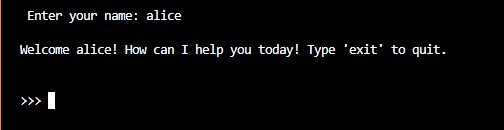

# AI Leave Management System Assistant

## Overview
This is a Python-based **Leave Management System** that allows employees to interact using natural language to:
- Check leave balances
- Request leaves
- Cancel leaves
- View leave history

An AI assistant processes user inputs using NLP to extract intent and entities, making the system intuitive and easy to use.

---


## Features
-  **Natural Language Interaction** (e.g., “I need 3 sick leaves starting from March 15”)
-  **Leave Types Supported:** Annual Leave, Sick Leave, Maternity Leave
-  **Leave Balance Checking:** Number of days allocated for each leave type
-  **Date Validation** (supports leap years, blocks invalid dates)
-  **Weekend Skipping**
-  **Individual Day Cancellation**
-  **Leave History Logging**

---

## Tech Stack
- **Backend**: python 3.8, GPT-4o
- **Frontend**: Terminal

## Installation

### Prerequisites
Before installation, ensure you have the following dependencies installed:
- Python **3.8**
- Pip (Python package manager)
- Virtual Environment (recommended for dependency isolation for openai)

### Setup Instructions
1. **Clone the Repository**
   ```bash
   git clone https://github.com/VirunaVidaswin/Leave_Manager.git 
   cd Leave_Manager
   ```

2. **Create a Virtual Environment (Optional but Recommended)**
   ```bash
   python -m venv venv
   venv\Scripts\activate  # On Windows use `source venv/bin/activate`
   ```

3. **Install Dependencies**
   ```bash
   pip install -r requirements.txt
   ```

## API key Configuration
To use external APIs (e.g., OpenAI), create a `.env` file in the project root and add your API key:
```env
OPENAI_API_KEY=your_api_key_here
```

## How to run the app
To launch the AI Leave Management System Assistant, run the following command after api and requirements are configured:
```bash
python Main.py

```
This will start a local server and prompt you to enter the employee name as so:


After name is identified you can prompt some questions like:
 - How many annual leaves do I have left?
 - I want to cancel my sick leave on April 2
 - Show me my leave history


## Assumptions made
-Leave types are restricted to: "Annual Leave", "Sick Leave", "Maternity Leave"

-Leaves cannot be taken on weekends or predefined holidays

-User inputs are parsed via OpenAI or regex fallback

-Leave history is stored in memory (not persistent)

-Each leave request spans consecutive days starting from a single start date

-The system assumes a single-user context per session

-Canceled dates are marked in history but not removed